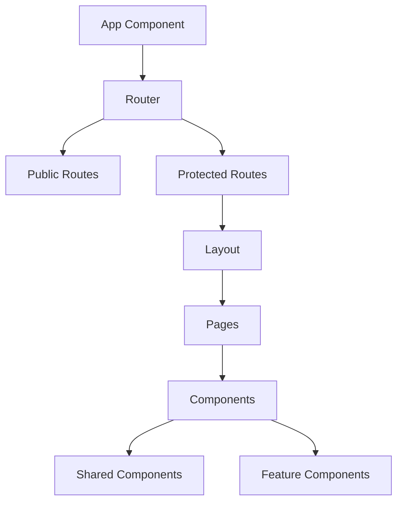
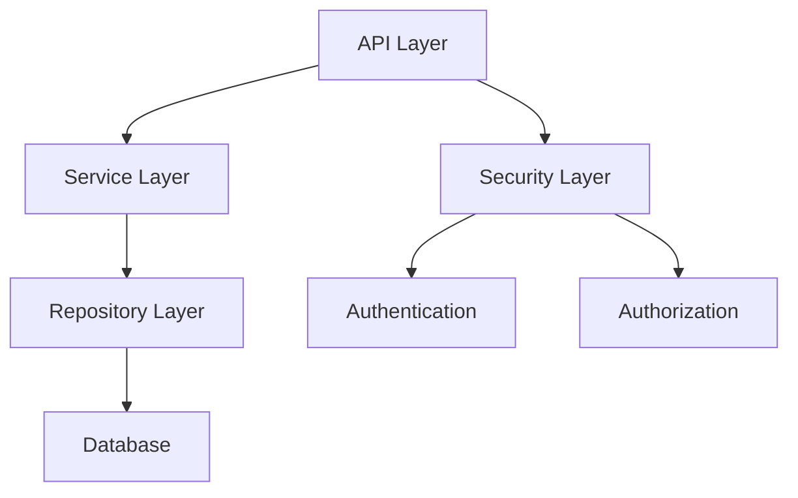
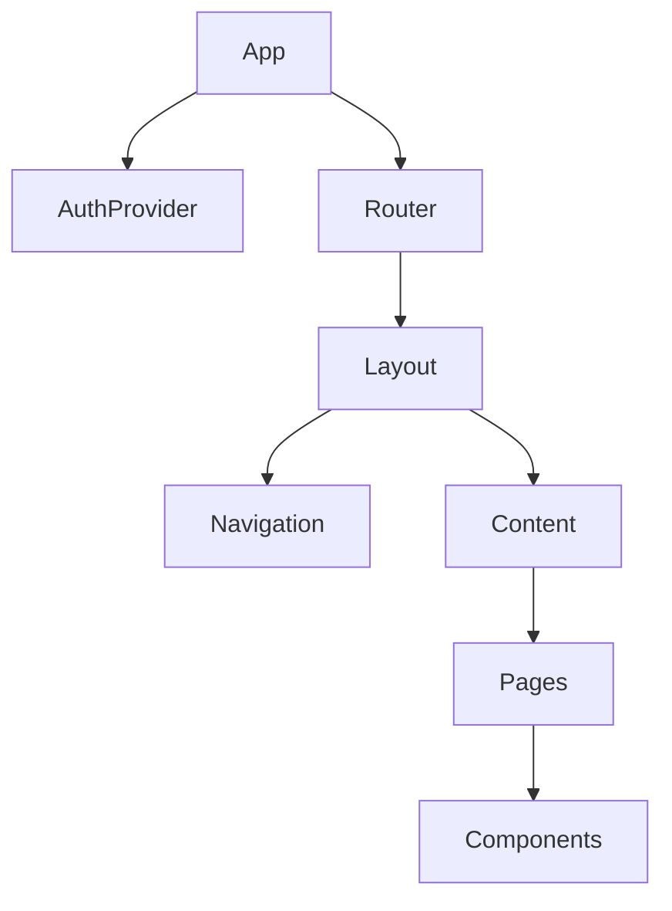
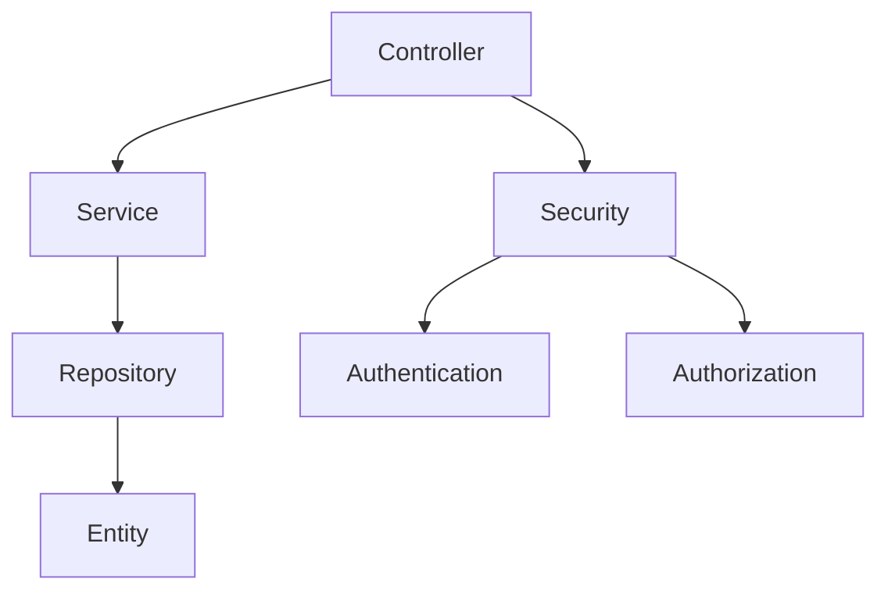

# WorkforceHub System Patterns

## Architecture Overview

### Frontend Architecture

### Backend Architecture

## Design Patterns

### 1. Authentication Pattern
- JWT-based authentication
- Token refresh mechanism
- Microsoft OAuth integration
- Role-based access control

### 2. State Management
- React Context for global state
- Local state for component-specific data
- Redux for complex state management
- Custom hooks for reusable logic

### 3. API Communication
- Axios for HTTP requests
- Interceptors for token management
- Error handling middleware
- Request/Response transformation

### 4. Component Architecture
- Atomic Design Pattern
- Container/Presenter Pattern
- Higher-Order Components
- Custom Hooks

## Technical Decisions

### Frontend
1. **Framework**: React with TypeScript
   - Type safety
   - Better developer experience
   - Enhanced maintainability

2. **Build Tool**: Vite
   - Fast development server
   - Optimized production builds
   - Modern tooling

3. **Styling**: Tailwind CSS
   - Utility-first approach
   - Responsive design
   - Custom theming

4. **Routing**: React Router
   - Declarative routing
   - Protected routes
   - Route-based code splitting

### Backend
1. **Framework**: Spring Boot
   - Enterprise-grade features
   - Rich ecosystem
   - Production-ready

2. **Database**: MySQL
   - Reliable and scalable
   - ACID compliance
   - Transaction support

3. **ORM**: JPA/Hibernate
   - Object-relational mapping
   - Query optimization
   - Database abstraction

4. **Security**: Spring Security
   - Comprehensive security features
   - OAuth2 support
   - JWT integration

## Component Relationships

### Frontend Components

### Backend Services

## Data Flow

### Authentication Flow
1. User initiates login
2. Frontend redirects to Microsoft OAuth
3. User authenticates with Microsoft
4. Backend validates token
5. JWT is issued
6. Frontend stores token
7. Protected routes are accessible

### API Request Flow
1. Component initiates request
2. Axios interceptor adds token
3. Request reaches backend
4. Security layer validates token
5. Controller processes request
6. Service handles business logic
7. Repository performs database operation
8. Response is sent back to frontend

## Error Handling

### Frontend
- Global error boundary
- API error interceptors
- Form validation
- User feedback components

### Backend
- Global exception handler
- Custom exception types
- Validation errors
- Security exceptions

## Testing Strategy

### Frontend
- Component testing with Jest
- Integration testing with React Testing Library
- E2E testing with Cypress
- Visual regression testing

### Backend
- Unit testing with JUnit
- Integration testing with Spring Test
- API testing with Postman
- Performance testing with JMeter 